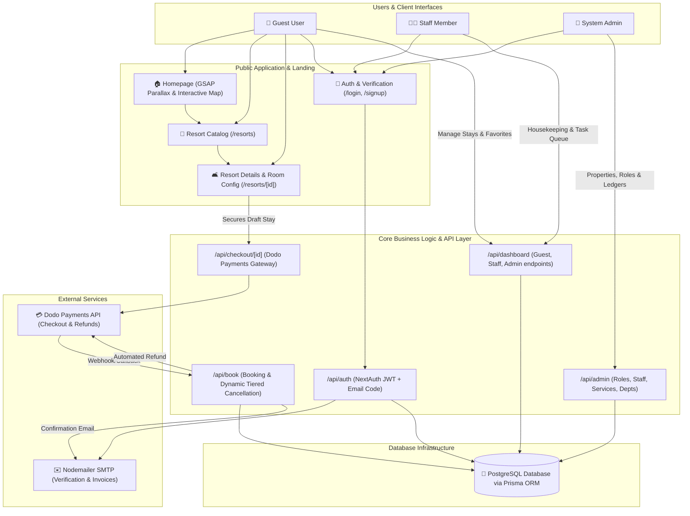
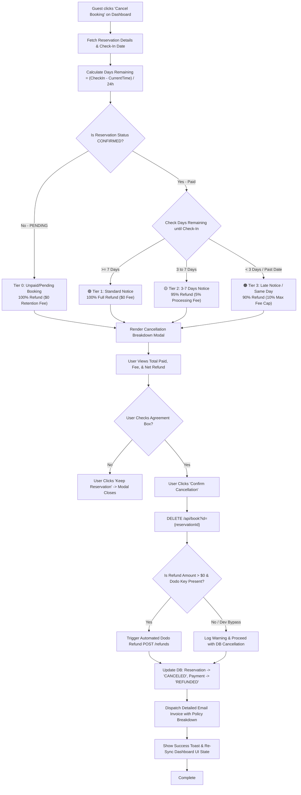
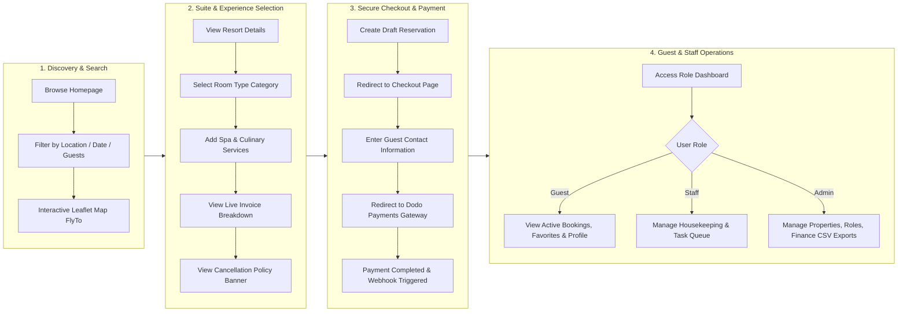

# Comprehensive Application Architecture & System Flowchart

**Project**: Online Resort Management & Booking System (`bookme.com`)  
**Stack**: Next.js 16 (App Router + Turbopack), React 19, TypeScript, Prisma ORM, PostgreSQL, NextAuth.js, Nodemailer, Dodo Payments API, Leaflet Maps, GSAP & Tailwind CSS.

---

## 1. High-Level System Architecture Flowchart

---

## 2. Dynamic Tiered Cancellation & Refund Flowchart

---

## 3. End-to-End User Journey Flowchart

---

## 4. Comprehensive Feature & Functionality Matrix

### 👤 Guest Portal Features
- **Cinematic Homepage**: GSAP scroll animations, 3D mouse parallax cards, interactive Leaflet resort map, and pricing estimator calculator.
- **Resort Discovery**: Instant search by location, guest counts, stay duration, and date ranges.
- **Suite Customization**: Real-time invoice estimation with add-on experience toggles (Lagoon Breakfast, Balinese Spa, Sunset High Tea).
- **Dynamic Tiered Cancellation**:
  - Full refund for ≥ 7 days notice.
  - 95% refund for 3–7 days notice (5% fee).
  - 90% refund for < 3 days / past check-in (capped at 10% maximum fee).
  - Interactive cancellation modal with clear financial breakdown.
- **Saved Favorites**: One-click bookmarking of luxury resorts.
- **Guest Profile**: Account verification status, reservation count, and contact management.

### 👨‍💼 Staff Desk Features
- **Task Queue Dashboard**: Real-time listing of guest requests, maintenance tasks, and service orders.
- **Housekeeping Desk**: Filter rooms by status (`CLEAN`, `DIRTY`, `IN_PROGRESS`, `INSPECTED`), assign staff members, and log status updates.
- **Guest Reservation Lookup**: Inspect check-in dates, suite numbers, and payment verification.

### 👑 Admin Management Features
- **Property & Room Management**: Create, edit, and archive resort properties, room categories, and suite numbers.
- **Role-Based Access Control (RBAC)**: Create custom staff roles with granular permissions (`MANAGE_BOOKINGS`, `HOUSEKEEPING`, `FINANCE_ACCESS`, `STAFF_MANAGEMENT`, `DEPT_MANAGEMENT`, `MANAGE_SERVICES`, `PROPERTIES_MANAGEMENT`).
- **Staff Directory**: Add new staff, assign departments, and update operational roles.
- **Financial Ledgers & CSV Exports**: One-click CSV export buttons for bookings audit logs and financial revenue ledgers.

---

## 5. API Endpoint Matrix

| Method | Endpoint | Access Role | Description |
| :--- | :--- | :--- | :--- |
| `GET` | `/api/resorts` | Public | List resorts with pagination, search query, and filters |
| `GET` | `/api/resorts/[id]` | Public | Fetch resort details, room types, and add-on services |
| `POST` | `/api/signup` | Public | Register new guest, send verification code via Nodemailer |
| `POST` | `/api/signup/verify` | Public | Verify 6-digit email code and activate account |
| `POST` | `/api/auth/[...nextauth]` | Public | Handle NextAuth JWT credentials login |
| `POST` | `/api/book` | Guest | Create draft stay reservation |
| `DELETE` | `/api/book` | Guest / Staff | Cancel reservation with dynamic tiered refund calculation |
| `GET` | `/api/checkout/[id]` | Guest | Fetch checkout session details & invoice breakdown |
| `POST` | `/api/checkout/[id]/session` | Guest | Generate Dodo Payments checkout session URL |
| `POST` | `/api/webhooks/dodo` | System | Process payment completion webhooks |
| `GET` | `/api/dashboard/guest` | Guest | Fetch guest reservations, favorites, and profile |
| `GET` | `/api/dashboard/staff` | Staff | Fetch housekeeping task queue and room statuses |
| `GET` | `/api/dashboard/admin` | Admin | Fetch system KPIs, revenue metrics, and audit logs |
| `GET/POST` | `/api/favorites` | Guest | Fetch and toggle bookmarked resorts |
| `GET/POST` | `/api/admin/roles` | Admin | Manage operational roles and granular permissions |
| `GET/POST` | `/api/admin/staff` | Admin | Manage staff accounts and department assignments |
| `GET/POST` | `/api/admin/departments` | Admin | Manage resort departments |
| `GET/POST` | `/api/admin/services` | Admin | Manage resort add-on services |
