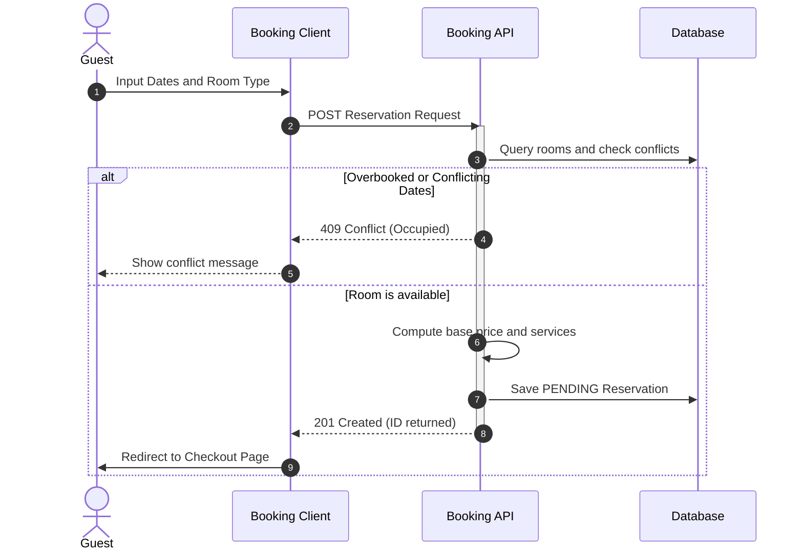
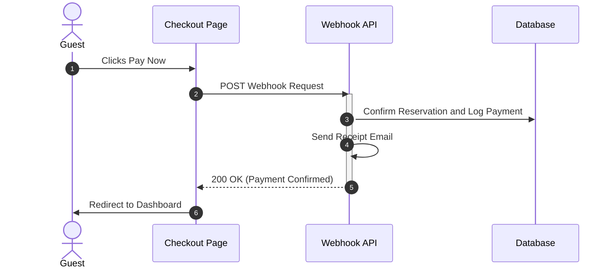
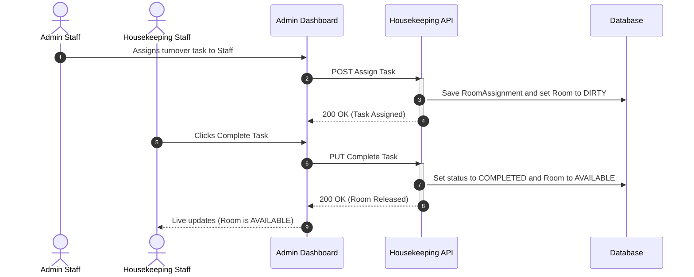
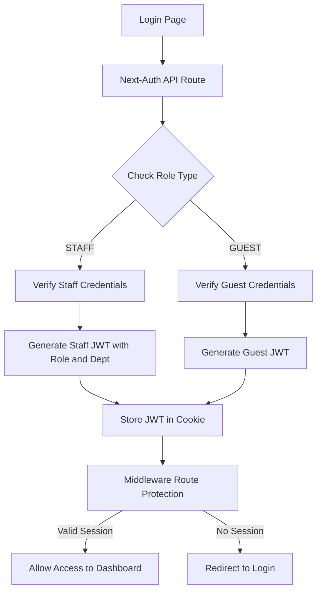

# Resort Room Booking and Management System: Application Flows

This document details the central operational flows of the application using structured sequence maps and logic paths.

---

## 1. Guest Booking Flow

The booking flow handles availability checks, pricing calculation, add-on service selections, and reservation persistence.

---

## 2. Checkout & Simulated Payment Flow

Payments are simulated through a checkout invoice page that fires a mock transaction request to the webhook callback.

---

## 3. Admin & Housekeeping Task Management Flow

Rooms are cleaned and maintained through a live operations panel. Admins assign tasks, and staff members execute and mark them as complete.

---

## 4. Next-Auth Session Propagation Flow

Authentication is managed via Next-Auth JSON Web Tokens (JWT) to secure layouts and propagate roles.

